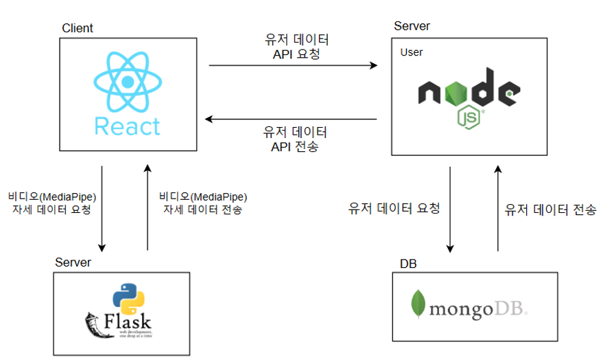
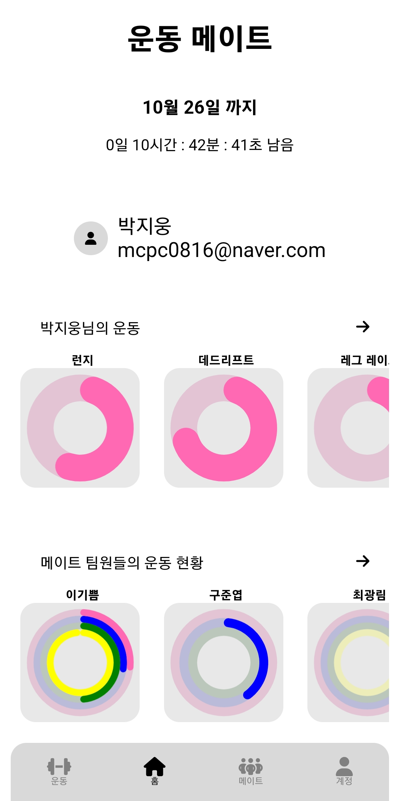
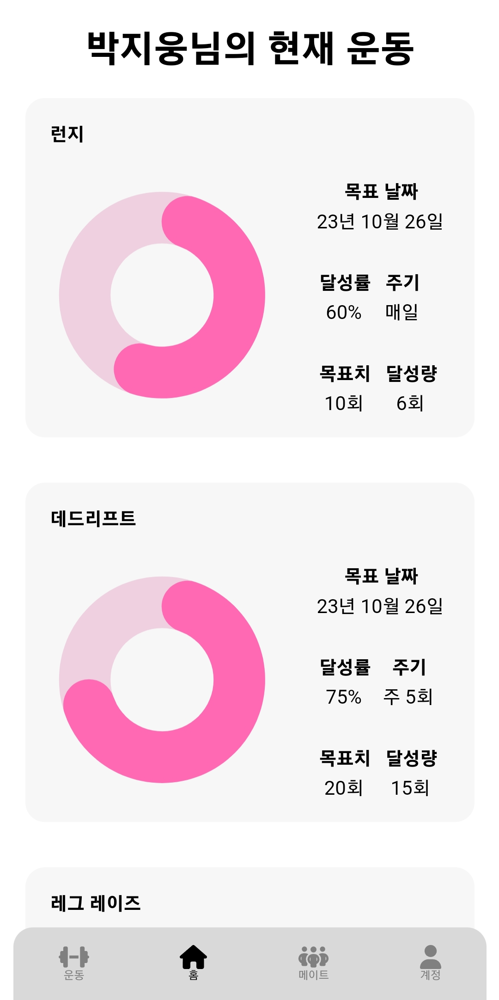
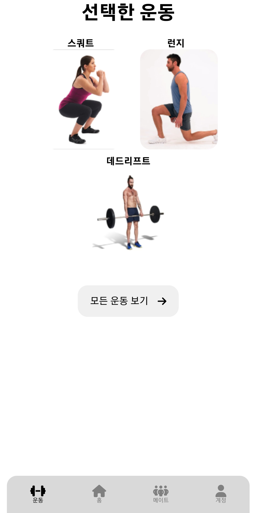
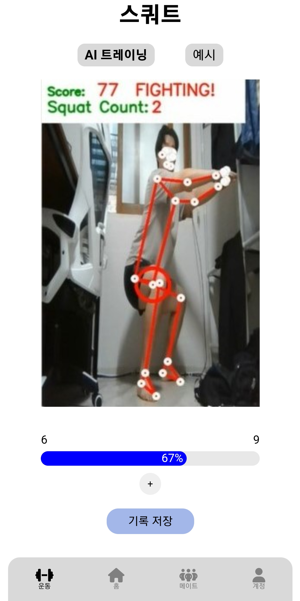
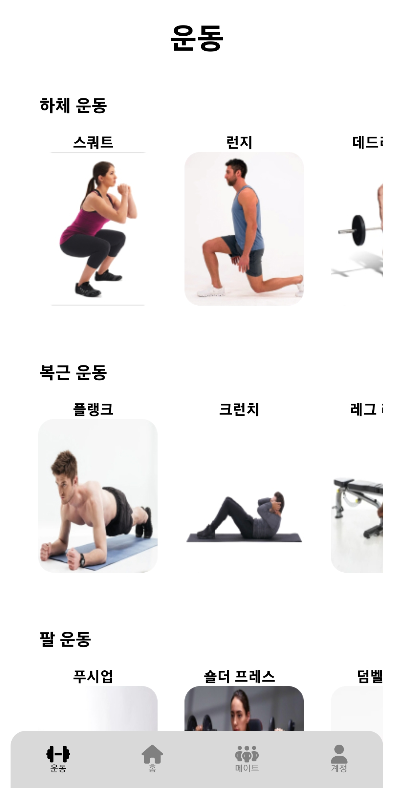
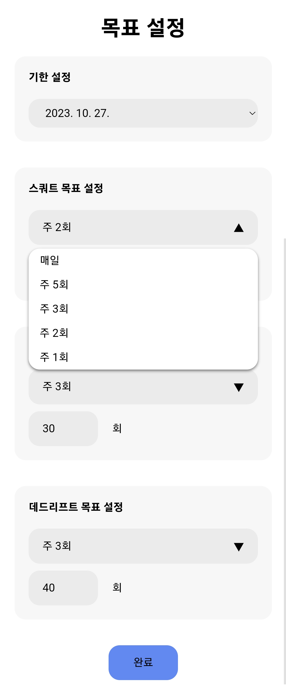
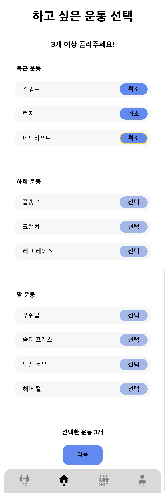

# 운동메이트 Front-End(React)

# **운동메이트** 배경
  고령화 사회가 되어가고 있는 지금 건강관리는 선택이 아닌 필수가 되어 가고 있습니다. 
  우리가 개발한 운동메이트 웹앱은 웹캠을 통해 실시간으로 사용자의 자세를 교정해줄 수 있습니다. 
  그리고 메이트들과 함께 하는 운동을 통해 운동에 대한 즐거움을 줍니다. 
  결과적으로 단기적인 운동이 아닌 장기적으로 운동을 할 수 있도록 동기부여를 줍니다. 

# **운동메이트** 과제 수행 결과
  운동 기록 저장되 메이트 팀 정보공유 기능을 통해 사용자가 혼자서 할 때 뿐만 아니라 메이트와 함께 운동 현황을 공유하며 동기부여를 받을 수 있도록 합니다

  
# 시스템 구성도
 

# **운동메이트** 인터페이스

## **아래 사진과 함께 인터페이스를 설명합니다**

## 홈페이지

 
홈페이지, 사용자가 선택한 운동의 세부 정보 페이지

## 운동 페이지

  

    
    
    
  

  사용자가 선택한 운동 리스트 페이지, 운동(스쿼트)하는 페이지, 모든 운동 선택 페이지
  

    
    
  

    
  운동 선택 후 목표 설정 페이지, 하고싶은 운동 선택 페이지
