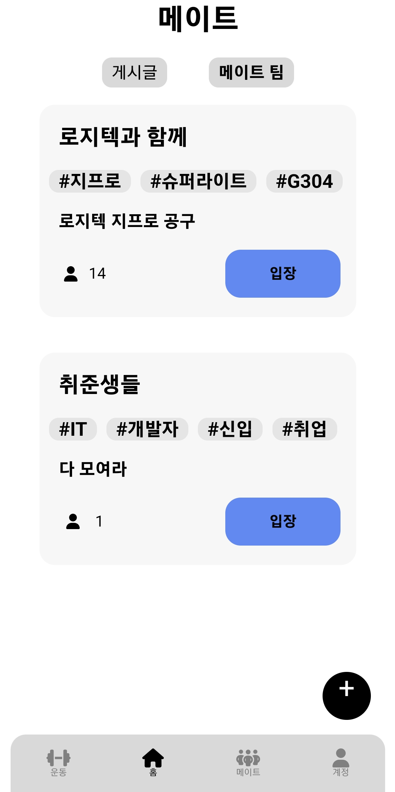
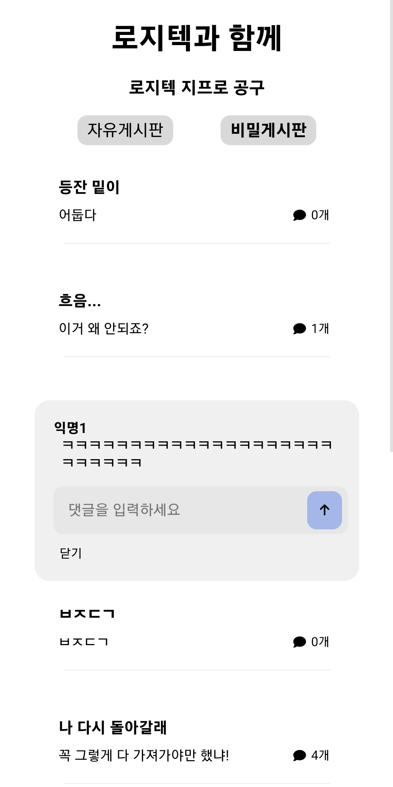
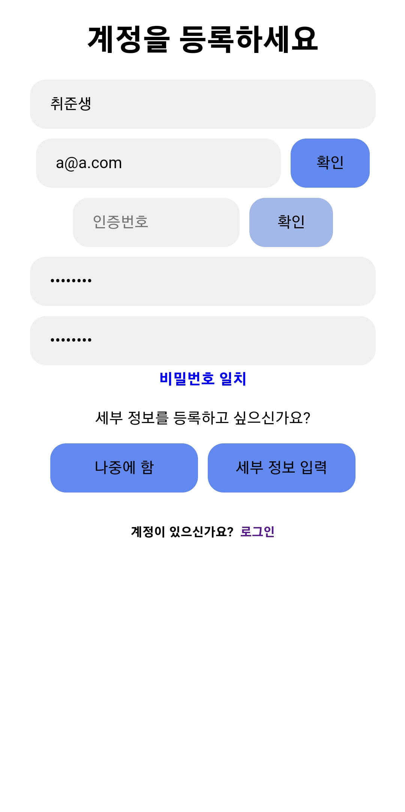

# 운동메이트 Front-End(React)

# **운동메이트** 배경
  고령화 사회가 되어가고 있는 지금 건강관리는 선택이 아닌 필수가 되어 가고 있습니다. 
  우리가 개발한 운동메이트 웹앱은 웹캠을 통해 실시간으로 사용자의 자세를 교정해줄 수 있습니다. 
  그리고 메이트들과 함께 하는 운동을 통해 운동에 대한 즐거움을 줍니다. 
  결과적으로 단기적인 운동이 아닌 장기적으로 운동을 할 수 있도록 동기부여를 줍니다. 

# **운동메이트** 과제 수행 결과
  운동 기록 저장되 메이트 팀 정보공유 기능을 통해 사용자가 혼자서 할 때 뿐만 아니라 메이트와 함께 운동 현황을 공유하며 동기부여를 받을 수 있도록 합니다

  
# 시스템 구성도
 

# **운동메이트** 인터페이스

## **아래 사진과 함께 인터페이스를 설명합니다**

## 홈페이지

<p align="center">


</p> 
홈페이지, 사용자가 선택한 운동의 세부 정보 페이지

## 운동 페이지

  <p align="center">
    
    
    
  </p>
  <p align="center"> 사용자가 선택한 운동 리스트 페이지, 운동(스쿼트)하는 페이지, 모든 운동 선택 페이지 </p>
  <p align="center">
    
    
  </p>
    
   <p align="center">운동 선택 후 목표 설정 페이지, 하고싶은 운동 선택 페이지 </p>


## 메이트 페이지

<p align="center">
    
    
    
</p>
<p align="center">가입하지 않은 메이트 팀 목록 페이지, 가입한 메이트 팀 목록 페이지, 게시글 수정</p>

<p align="center">
    
    
    
</p>
<p align="center">게시글 수정·삭제 모달, 게시글 업로드, 게시판 글 작성</p>

<p align="center">
    
    
    
</p>
<p align="center">공지 페이지, 공지글 작성, 공지 수정</p>

<p align="center">
    
    
    
</p>
<p align="center">공지 수정·삭제 모달, 다른 사용자 정보 페이지, 메이트 팀</p>

<p align="center">
    
    
    
</p>
<p align="center">SNS 피드 페이지, SNS에 작성한 댓글 삭제, 익명게시판 </p>

<p align="center">
    
    
    
</p>
<p align="center">자유게시판, 채팅,  메이트 팀 만들기</p>

<p align="center">
    
</p>
<p align="center">회원목록 페이지</p>


## 계정 페이지

<p align="center">
    
    
    
</p>
<p align="center">유저 고민 수정, 유저 기본 정보 수정, 유저 세부정보(예시 : 나이) 수정 </p>

<p align="center">
    
    
    
</p>
<p align="center">유저 정보, 유저 정보 공개 여부 설정,  유저 정보 수정 페이지</p>

<p align="center">
    
</p>
<p align="center">팔로잉 리스트</p>


## 로그인, 회원가입 페이지

<p align="center">
    
    
    
</p>
<p align="center">로그인 페이지, 세부 정보 입력 여부, 자세한 정보 입력 </p>

<p align="center">
    
    
    
</p>
<p align="center">주로 하는 운동 입력 페이지 , 회원가입 완료시 폭죽 터짐,  해결하고싶은 고민 입력 페이지</p>

<p align="center">
    
    
</p>
<p align="center">회원가입 페이지, 회원가입 완료 알림</p>


  ## 프로젝트 디렉터리 구조
```
  React

  pose
  ├─public
  ├─src
  │  ├─assets          //운동 이미지
  │  ├─components      //화면을 구성할 컴포넌트
  │  ├─config          //각종 json파일
  │  ├─constants       //상수 값
  │  ├─pages           // 주요 페이지
  │  ├─services        //api 호출, 외부 서비스 관리(firebase)
  │  ├─store           //전역 상태 관리(redux)
  │  ├─utils           //재사용되는 함수
  │  ├─app.js
  └─ └─package.json
 
```


## 전역 상태 관리 - Redux-toolkit

  - ### 초기 상태
```
const initialState = {
    _id:null,
    email: null,
    name: null,
    token: null,
    age: null,
    area: null,
    sex: null,
    weight: null,
    height: null,
    exercise: null,
    wishList: null,
    followers: null,
    followerNames:null,
    following: null,
    followingNames:null,
    dDay: null,
    goals: null,
    activeNav:'/',
    setting: null,
}

```


  - ### 상태 관리 함수
    | 함수명 | 기능|
    | --- | --- |
    | navClick | 유저가 머물고 있는 페이지의 네비게이션바 아이콘 bold |
    | login | 로그인시 jwt 저장 |
    | logout | 로그아웃시 초기상태 삭제 |
    | getUserFullInfo | 로그인시 초기상태 저장 |
    | putFollow | 수정된 팔로우 리스트 저장 |
    | putGoals | 수정된 목표 리스트 저장 |
    | updateAttain | 운동 목표 업데이트 |
    | putFollowerNames | 수정된 팔로우 유저 이름 리스트 저장 |
    | putFollowingNames | 수정된 팔로잉 유저 이름 리스트 저장 |
    | updateProfile | 수정된 프로필 정보 저장 |
    | updateAge | 수정된 나이 정보 저장 |
    | updateArea | 수정된 지역 정보 저장 |
    | updateWeight | 수정된 몸무게 정보 저장 |
    | updateHeight | 수정된 키 정보 저장 |
    | updateExercise | 수정된 운동 정보 저장 |
    | updateWishList | 수정된 해결하고싶은 고민 정보 저장 |
    | updateItemPublic | 수정된 세부 정보 공개 여부값 저장 |
    


    # Conventions

## ⚙ 사용 기술

### :earth_africa: Environment

<div>
    
    
    
</div>

<br />

### :pick: Development

<div>
    
    
    
  
</div>

<br />

### :mega: Communication

<div>
    
</div>

<br />


